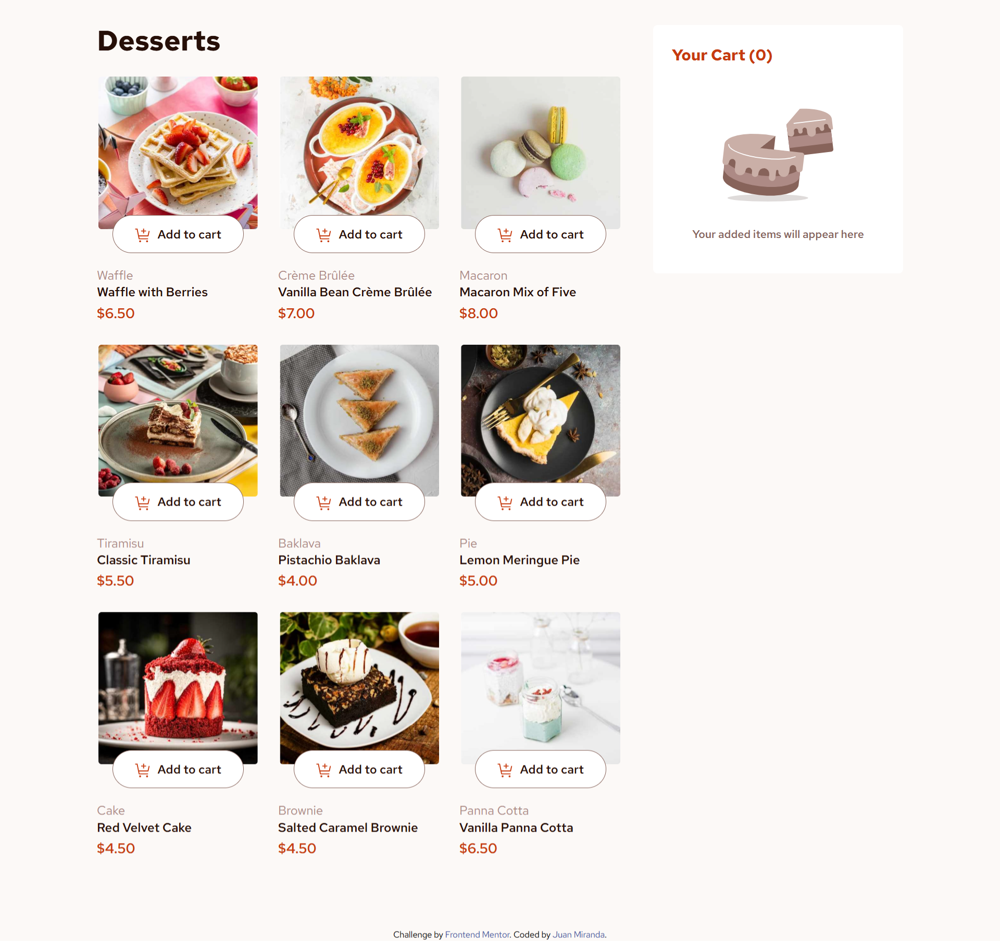

# Frontend Mentor - Product list with cart solution

This is a solution to the [Product list with cart challenge on Frontend Mentor](https://www.frontendmentor.io/challenges/product-list-with-cart-5MmqLVAp_d). Frontend Mentor challenges help you improve your coding skills by building realistic projects. 

## Table of contents

- [Overview](#overview)
- [The challenge](#the-challenge)
- [Screenshot](#screenshot)
- [Links](#links)
- [Built with](#built-with)
- [Author](#author)

## Overview

### The challenge

Users should be able to:

- Add items to the cart and remove them
- Increase/decrease the number of items in the cart
- See an order confirmation modal when they click "Confirm Order"
- Reset their selections when they click "Start New Order"
- View the optimal layout for the interface depending on their device's screen size
- See hover and focus states for all interactive elements on the page

### Screenshot

### Links

- Solution URL: [Github](https://github.com/JuanMiranda1998/product-list-frontend-mentor)
- Live Site URL: [Netlify](https://product-list-juanmiranda.netlify.app/)

## My process

### Built with

- Flexbox
- Mobile-first workflow
- [React](https://reactjs.org/) - JS library
- [TailwindCSS](https://tailwindcss.com/) - CSS Framework

## Author

- Frontend Mentor - [@JuanMiranda1998](https://www.frontendmentor.io/profile/JuanMiranda1998)
- Twitter - [@juan__miranda__](https://twitter.com/juan__miranda__)